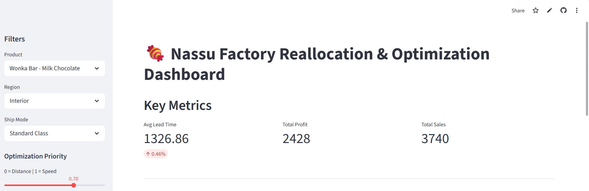
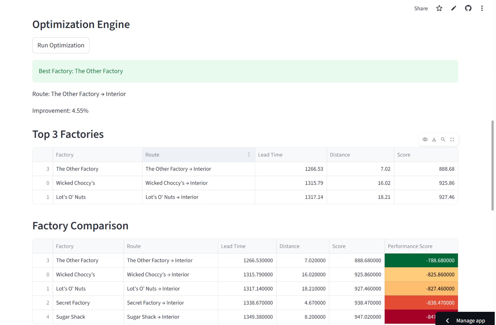
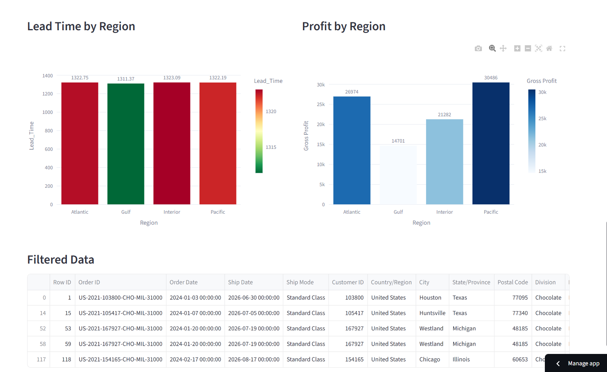
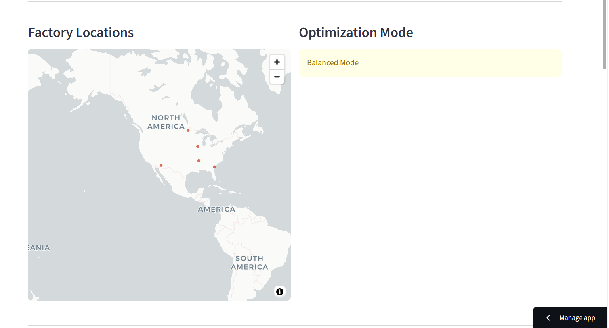

 🍬 Factory Reallocation & Shipping Optimization System

 Author
Javvaji Durga Rani 
Aspiring Data Analyst / Data Scientist  

🔗 GitHub: https://github.com/javvajidurgarani/Factory-Optimization-Dashboard
🌐 Live App: [click here to view app] https://factory-optimization-dashboard-3voubtzukaa3tfchwzusc5.streamlit.app/


 Project Overview
This project builds an intelligent decision system to optimize factory allocation and improve shipping efficiency for a distributor.

It combines **Machine Learning + Optimization logic** to recommend the best factory for each product based on lead time, region, and shipping mode.


 Problem Statement

Traditional factory assignment leads to:

- High shipping lead time  
- Increased logistics cost  
- No decision-making system  
- Inefficient product-to-factory mapping  

This project solves these problems using predictive analytics and simulation.


 Features

-  Predict shipping lead time using ML models  
- Factory simulation engine  
-  Optimization (speed vs performance)  
-  Interactive dashboard using Streamlit  
-  Interactive charts (Plotly)  
-  Factory location map  
-  Top 3 factory recommendations  
-  Performance scoring system  


 Machine Learning Models

- Linear Regression  
- Random Forest Regressor  
- Gradient Boosting Regressor  

 Evaluation Metrics
- MAE (Mean Absolute Error)  
- RMSE (Root Mean Squared Error)  
- R² Score  


  How It Works

1. Data preprocessing & cleaning  
2. Feature encoding (Region, Ship Mode, Factory)  
3. Model training & evaluation  
4. Lead time prediction  
5. Factory simulation  
6. Optimization logic  
7. Recommendation generation  


 Dashboard Preview

 🔹 Overview


### 🔹 Optimization Output


### 🔹 Charts


### 🔹 Map View


---

Key Insights

- Reduced shipping lead time using optimized factory selection  
- Identified slow-performing routes  
- Enabled data-driven decision making  
- Balanced operational efficiency and performance  

---

 Tech Stack

- Python  
- Pandas  
- NumPy  
- Scikit-learn  
- Streamlit  
- Plotly  
- Matplotlib  

---

 Run Locally

```bash
pip install -r requirements.txt
streamlit run app.py